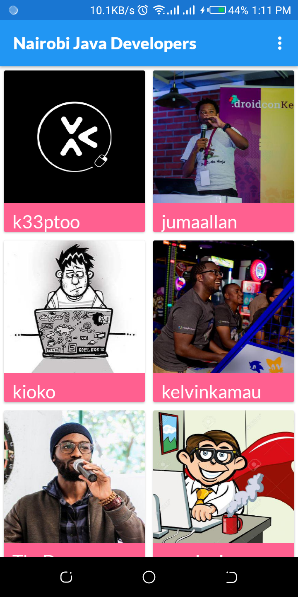
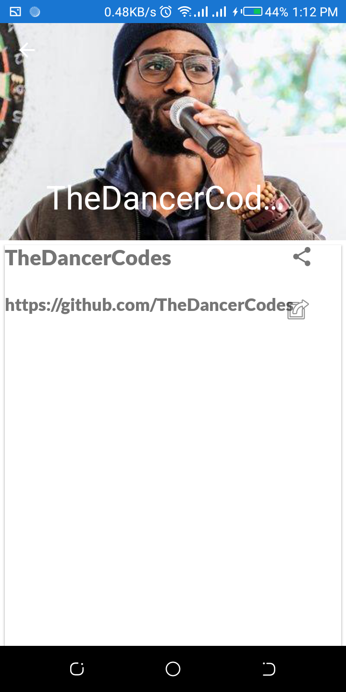
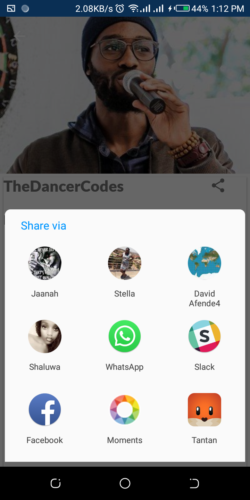

# Android-levelUP

## Status Badges

# Converge-LevelUp Project
An android App that retrieves a list of Java developers located in Nairobi.

## Images

 
 
 

## Technologies Used.
* Android
* XML
* Java

## Features.
* List all Java Developers in Nairobi.
* View developer's profile.
* Share developer's profile

## Prerequisites.
* Android studio.
* Linux, macOS or Windows.

## Getting Started.
Clone this repository onto your local machine [https://github.com/joshNic/Android-levelUP]

Change directory into the Android-levelUP directory.
`cd Android-levelUP`

Then open and run your project in Android Studio.
